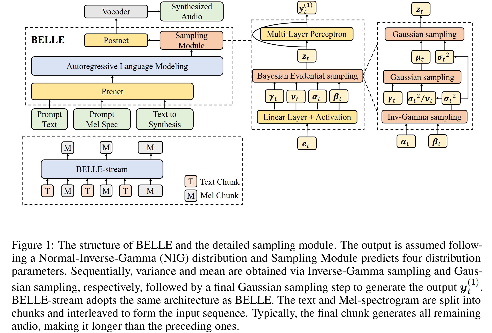

# BELLE

[](https://arxiv.org/abs/2510.24372)
[](LICENSE)
[](https://www.python.org/)

This is the **official repository** for the paper: **[Bayesian Speech Synthesizers Can Learn from Multiple Teachers](https://arxiv.org/abs/2510.24372)**.  
This codebase provides training, data preparation, and evaluation pipelines for **BELLE**, and also **reproduces MELLE**.

---

## ✨ Highlights
- End‑to‑end training and evaluation pipelines aligned with the paper.
- Modular data pipeline with optional TTS‑based augmentation.
- Multi‑model training scripts for BELLE / MELLE / BELLE‑stream.
- Zero‑shot TTS evaluation suite under [evaluate-zero-shot-tts](evaluate-zero-shot-tts).

---

## 🧠 Model Overview
BELLE reframes TTS as **Bayesian inference** rather than deterministic regression. It models acoustic targets with a **Normal‑Inverse‑Gamma** distribution to capture data‑dependent aleatoric uncertainty **without increasing parameters or inference latency**. To learn reliable variance from single‑reference datasets, BELLE introduces a **one‑to‑many training strategy** that leverages synthetic samples as a statistical support set. The framework naturally supports **high‑quality streaming generation**.

**Architecture at a glance:**



**Key contributions (summary):**
- Bayesian evidential learning for continuous AR TTS with uncertainty modeling.
- One‑to‑many training with multiple teachers to improve robustness.
- Strong results with smaller data scale and streaming capability.

---

## 📦 Repository Layout

```
BELLE/
├─ belle/                       # Core library (models, modules, utils)
├─ egs/librispeech/             # Data prep + training entrypoints
├─ evaluate-zero-shot-tts/      # Zero‑shot evaluation suite
├─ tts-launch/                  # TTS augmentation launch scripts
├─ scripts/                     # High‑level run scripts (train/eval/env)
├─ pretrained/                  # Pretrained checkpoints (if any)
└─ Figures/                     # Paper figures (optional)
```

---

## 🧰 Environment Setup
The environment setup script is provided at:

- [scripts/setup.sh](scripts/setup.sh)

It creates a `conda` environment, installs dependencies, pulls `k2`, installs `icefall`, and sets up evaluation dependencies.

> ⚠️ **Note:** The `k2` wheel must match your CUDA and PyTorch versions.  
> See the comment inside [scripts/setup.sh](scripts/setup.sh) for guidance.

---

## 📥 Pretrained Weights (Vocoder + Evaluation Models)
Please download the following pretrained weights and place them under the [pretrained](pretrained) directory as indicated:

- **Vocoder (HiFi-GAN, LibriTTS):**
  - Source: https://huggingface.co/mechanicalsea/speecht5-tts/tree/main/pretrained_vocoder/train_nodev_clean_libritts_hifigan.v1
  - Target: [pretrained/tts-hifigan-train](pretrained/tts-hifigan-train)
- **ASR (Conformer WER):**
  - Source: https://huggingface.co/nvidia/stt_en_conformer_transducer_xlarge/tree/main
  - Target: [pretrained/evaluation/stt_en_conformer_transducer_xlarge.nemo](pretrained/evaluation/stt_en_conformer_transducer_xlarge.nemo)
- **ASR (HuBERT WER):**
  - Source: https://huggingface.co/facebook/hubert-large-ls960-ft/tree/main
  - Target: [pretrained/evaluation/hubert-large-ls960-ft](pretrained/evaluation/hubert-large-ls960-ft)
- **Speaker Similarity (WavLM‑Uni):**
  - Source: https://drive.google.com/file/d/1-aE1NfzpRCLxA4GUxX9ITI3F9LlbtEGP/view
  - Target: [pretrained/evaluation/wavlm_large_finetune.pth](pretrained/evaluation/wavlm_large_finetune.pth)
- **MOS (UTMOS):**
  - Source: https://github.com/tarepan/SpeechMOS/releases/download/v1.0.0/utmos22_strong_step7459_v1.pt
  - Target: [pretrained/evaluation/utmos22_strong_step7459_v1.pt](pretrained/evaluation/utmos22_strong_step7459_v1.pt)

**Path configuration note:**
If you place these files in a different location, update the paths in:
- [belle/data/tokenizer.py](belle/data/tokenizer.py) (vocoder path)
- [evaluate-zero-shot-tts/evaluate_new.py](evaluate-zero-shot-tts/evaluate_new.py) (ASR / SIM model paths)
- [evaluate-zero-shot-tts/utmos/predict_speechmos.py](evaluate-zero-shot-tts/utmos/predict_speechmos.py) (MOS model path)

---

## 🧪 Data Pipeline (LibriSpeech)
First download LibriSpeech from the official page: **https://www.openslr.org/12** and extract it to:

- [egs/librispeech/download/LibriSpeech](egs/librispeech/download/LibriSpeech) (see Step 0 in the script below)

The end‑to‑end data pipeline is implemented in:

- [egs/librispeech/utils/data_pipeline.sh](egs/librispeech/utils/data_pipeline.sh)

**Overview of steps:**
1. Prepare LibriSpeech manifests and tokenize text (G2P phonemes).
2. Apply VAD and regenerate manifests.
3. Filter by duration.
4. *(Optional)* TTS‑based augmentation using multiple models.
5. VAD on synthesized audio and filter failed items.
6. Prepare training cuts for BELLE / MELLE.
7. Prepare prompt‑augmented cuts for BELLE‑stream.

---

## 🚀 Training
Training is driven by the scripts below:

- **BELLE:** [scripts/run_belle.sh](scripts/run_belle.sh)
- **MELLE:** [scripts/run_melle.sh](scripts/run_melle.sh)
- **BELLE‑stream:** [scripts/run_stream.sh](scripts/run_stream.sh)

All training scripts invoke [egs/librispeech/bin/trainer.py](egs/librispeech/bin/trainer.py) with distributed `torchrun`.

**Typical workflow:**
1. Run the data pipeline.
2. Start training with the corresponding run script listed above.
3. For BELLE‑stream, initialize from the last BELLE checkpoint and set `start_epoch=2`, `train_stage=2` (already reflected in [scripts/run_stream.sh](scripts/run_stream.sh)).

---

## 📊 Evaluation (Zero‑Shot TTS)
Evaluation is managed under:

- [evaluate-zero-shot-tts/scripts/pipeline_new.sh](evaluate-zero-shot-tts/scripts/pipeline_new.sh)

This pipeline includes **inference + evaluation**, and supports metrics such as:
- **WER** (Hubert / Conformer ASR backends)
- **MOS** (UTMOS)
- **Similarity** (WavLM‑Uni: `sim_o`, `sim_r`)

### 📦 Evaluation Data Download
Download the evaluation dataset here:
- https://drive.google.com/drive/folders/1TfYCUpccGNOBTnGCEN3qczavMiiFQjJV?usp=sharing

Place it under the project root with the following structure (excerpt):

```
evaluate-zero-shot-tts/evalset
  ├── librispeech-test-clean
  │   ├── exp_aligned_pl3_r3
  │   │   ├── {FILE_NAME}_wav_c_{TRIAL_ID}.txt
  │   │   ├── {FILE_NAME}_wav_c_{TRIAL_ID}.wav
  │   │   ├── {FILE_NAME}_wav_g.txt
  │   │   ├── {FILE_NAME}_wav_g.wav
  │   │   ├── {FILE_NAME}_wav_p_{TRIAL_ID}.txt
  │   │   ├── {FILE_NAME}_wav_p_{TRIAL_ID}.wav
  │   │   ├── {FILE_NAME}_wav_pg_{TRIAL_ID}.txt
  │   │   ├── {FILE_NAME}_wav_pg_{TRIAL_ID}.wav
  │   │   ...
  │   └── exp_base_pl3_r3
  │       ...
```

We made several modifications to the original repository [keonlee9420/evaluate-zero-shot-tts](https://github.com/keonlee9420/evaluate-zero-shot-tts) (e.g., adding Conformer‑based WER and UTMOS support) to better fit the BELLE evaluation pipeline. For full details, see [evaluate-zero-shot-tts/README.md](evaluate-zero-shot-tts/README.md).

---

## 📝 Citation
If you use this repository, please cite the paper:

```
@article{zhang2025bayesian,
  title={Bayesian Speech Synthesizers Can Learn from Multiple Teachers},
  author={Zhang, Ziyang and Gao, Yifan and Xu, Xuenan and Wu, Wen and Zhang, Chao and others},
  journal={arXiv preprint arXiv:2510.24372},
  year={2025}
}
```

---

## 📄 License
See [LICENSE](LICENSE).

---

## 🙏 Acknowledgements
We heavily referenced the implementation from **[lifeiteng/vall-e](https://github.com/lifeiteng/vall-e)** for the training framework and **[keonlee9420/evaluate-zero-shot-tts](https://github.com/keonlee9420/evaluate-zero-shot-tts)** for the evaluation framework.
This project also builds upon **[icefall](https://github.com/k2-fsa/icefall)** and related open‑source speech toolkits.
